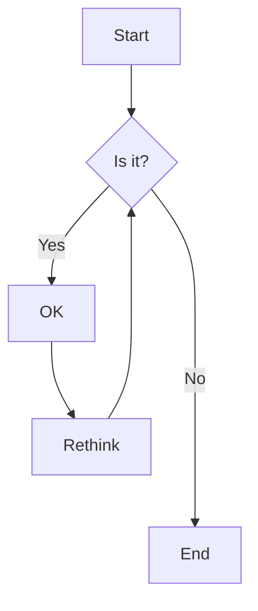

# 实验二 Python变量、简单数据类型和列表简介

---
班级： 21计科1

学号： 202302200000

姓名： 张三

---

## 实验目的

1. 使用VSCode编写和运行Python程序
2. 学习Python变量和简单数据类型
3. 学习Python列表的使用

## 实验环境

1. Git
2. Python 3.10
3. VSCode
4. VSCode插件


## 实验内容和步骤

### 第一部分 实验环境的安装

1. 安装Python，从Python官网下载Python 3.10安装包，下载后直接点击可以安装：[Python官网地址](https://www.python.org/downloads/)
2. 从github克隆课程的仓库，[课程的仓库地址](https://github.com/zhoujing204/python_course),使用git克隆仓库的方法，运行git bash，在命令行输入下面的命令（命令运行成功后，课程仓库会默认存放在Windows的用户文件夹下）

```bash
git clone https://github.com/zhoujing204/python_course.git
```

3. 安装VScode，下载地址：[Visual Studio Code](https://code.visualstudio.com/)
4. 为了在VSCode集成环境下编写和运行Python程序，安装下列VScode插件
   - Python
   - Python Environment Manager
   - Python Indent
   - Python Extended
   - Python Docstring Generator
   - Jupyter
   - indent-rainbow
   - Django
   - Jinja
   - Python Indent
   - Python Test Explorer for Visual Studio Code

### 第二部分 Python变量、简单数据类型和列表简介

教材《Python编程从入门到实践》P436附录D：使用Git进行版本控制，按照教材的步骤，完成Git基础的学习。

### 第三部分 Codewars Kata挑战

访问[learngitbranching.js.org](https://learngitbranching.js.org)，如下图所示完成Main部分的Introduction Sequence和Ramping Up两个小节的学习。


### 第四部分 使用Mermaid绘制程序流程图

安装VSCode插件：

- Markdown Preview Mermaid Support
- Mermaid Markdown Syntax Highlighting

使用Markdown语法绘制程序流程图，Markdown代码如下：


显示效果如下：



查看Mermaid流程图语法-->[点击这里](https://mermaid.js.org/syntax/flowchart.html)

使用Markdown编辑器（例如VScode）编写本次实验的实验报告，包括[实验过程与结果](#实验过程与结果)、[实验考查](#实验考查)和[实验总结](#实验总结)，并将其导出为 **PDF格式** 来提交。

## 实验过程与结果

请将实验过程中编写的代码和运行结果放在这里，注意代码需要使用markdown的代码块格式化，例如Git命令行语句应该使用下面的格式：


显示效果如下：

```bash
git init
git add .
git status
git commit -m "first commit"
```

如果是Python代码，应该使用下面代码块格式，例如：


显示效果如下：

```python
def add_binary(a,b):
    return bin(a+b)[2:]
```

代码运行结果可以直接粘贴在这里，或者使用截图。

## 实验考查

请使用自己的语言回答下面的问题，这些问题将在实验检查时用于提问和答辩以及实际的操作。

1. 什么是版本控制？使用git作为版本控制软件有什么优点？

2. 如何使用Git撤销还没有Commit的修改？如何使用Git检出（Checkout）已经以前的Commit？（实际操作）

3. Git中的HEAD是什么？如何让HEAD处于detached HEAD状态？（实际操作）

4. 什么是分支（Branch）？如何创建分支？如何切换分支？（实际操作）

5. 如何合并分支？git merge和git rebase的区别在哪里？（实际操作）

6. 什么是Markdown？为什么要使用Markdown？

7. 如何在Markdown格式的文本中使用标题、数字列表、无序列表和超链接？（实际操作）

## 实验总结

总结一下这次实验你学习和使用到的知识，例如：编程工具的使用、数据结构、程序语言的语法、算法、编程技巧、编程思想。
