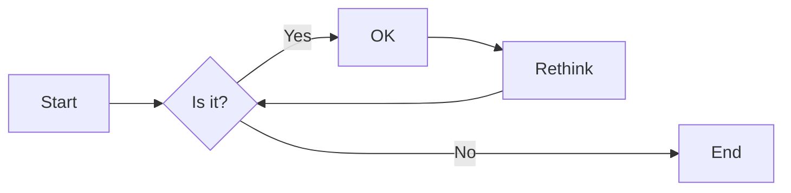
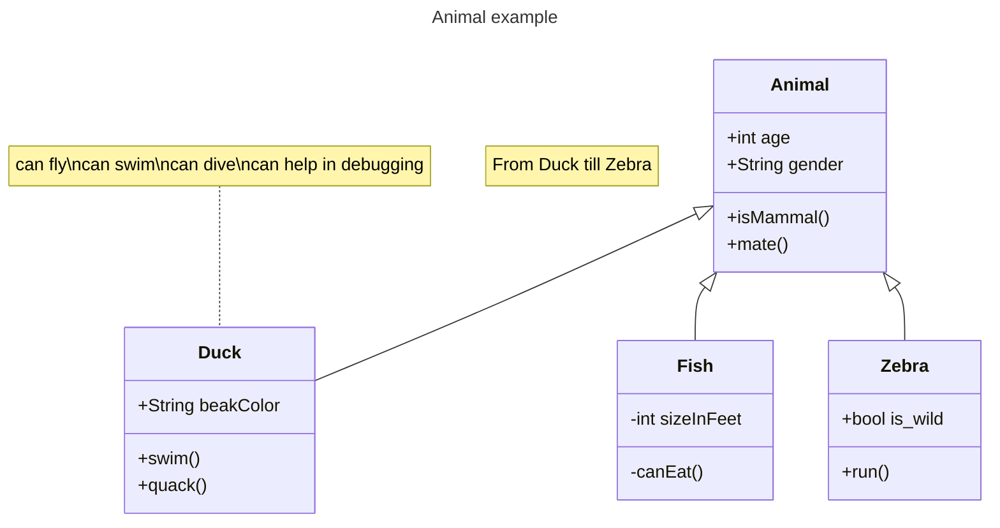

# 实验二 外星人入侵游戏开发(6学时)

## 实验目的

1. Python基础：Python基础语法、Python标准库
2. Pygame的使用
3. 使用Git进行版本控制和团队协作

## 实验环境

1. Git
2. Python
3. VSCode
4. VSCode插件
   - Python
   - Markdown PDF
   - Markdown Preview Mermaid Support
   - GitLens

## 实验内容和步骤

### 第一部分 实验环境的安装

1. 再命令行运行`pip install pygame`,安装`pygame`库;
2. 安装vscode以及vscode的插件:
   - Python
   - Markdown PDF
   - Markdown Preview Mermaid Support
   - GitLens

### 第二部分 使用Git进行团队协作

1. 由项目组长创建一个新的Git仓库，命名为`alien_invasion`，编写项目的`readme.md`文件，例如：

```markdown
# 外星人入侵游戏
[关于项目的一些介绍]
```

2.项目组长将项目的Git仓库链接分享给其他组员，其他组员fork该项目并clone到本地，例如：`git clone https://gitee.com/<teammate_username>/alien_invasion.git`。

3.项目组长创建`dev`分支，其他组员切换到`dev`分支，例如：`git checkout -b dev origin/dev`。

4.项目组长创建`feature`分支，例如：`git checkout -b feature1`，其他组员切换到`feature`分支，例如：`git checkout -b feature2`。

5.其他组员在各自的`feature`分支上进行开发，开发后提出`pull request`，项目组长进行`code review`，并合并到`dev`分支:

- Gitee网站的`Pull Request`工作流程请查看[Gitee Pull Request](https://gitee.com/help/articles/4128)

- Github网站的`Pull Request`工作流程请查看[Github Pull Request](https://docs.github.com/zh/pull-requests/collaborating-with-pull-requests/proposing-changes-to-your-work-with-pull-requests/creating-a-pull-request)

### 第三部分 教材第12章-武装飞船

按照教材章节完成外星人入侵游戏第一部分开发：

- 12.3 开始游戏项目
- 12.4 添加飞船图像
- 12.5 重构： `_check_events()`和`_update_screen()`方法
- 12.6 驾驶飞船
- 12.7 简单回顾
- 12.8 射击

重点需要完成的习题任务：

- 练习 12.4：火箭　编写一个游戏，它在屏幕中央显示一艘火箭，而玩家可使用上下左右四个方向键移动火箭。务必确保火箭不会移动到屏幕之外。

- 练习 12.6：《横向射击》　编写一个游戏，将一艘飞船放在屏幕左侧，并允许玩家上下移动飞船。在玩家按空格键时，让飞船发射一颗在屏幕中向右飞行的子弹，并在子弹从屏幕中消失后将其删除。

### 第四部分 教材第13章-外星人

按照教材章节完成外星人入侵游戏第二部分开发：

- 13.2 创建第一个外星人
- 13.3 创建外星人舰队
- 13.4 移动外星人
- 13.5 击落外星人
- 13.6 结束游戏

重点需要完成的习题任务：

- 练习 13.1：星星　找一幅星星图像，并在屏幕上显示一系列排列整齐的星星。
- 练习 13.2：更逼真的星星　为让星星的分布更逼真，可随机地放置星星。
- 练习 13.3：雨滴　寻找一幅雨滴图像，并创建一系列整齐排列的雨滴。让这些雨滴往下落，直到到达屏幕的下边缘后消失。
- 练习 13.6：游戏结束　在游戏《横向射击》中，记录飞船被撞到了多少次以及有多少个外星人被击落了。确定合适的游戏结束条件，并在满足该条件后结束游戏。

### 第五部分 教材第14章-计分

按照教材章节完成外星人入侵游戏第三部分开发：

- 14.1 添加Play按钮
- 14.2 提高难度
- 14.3 计分

重点需要完成的习题任务：

- 练习 14.1：按 P 键开始新游戏　鉴于游戏《外星人入侵》使用键盘来控制飞船，最好让玩家也能够通过按键来开始游戏。请添加在玩家按 P 键时开始游戏的代码。
- 练习 14.4：难度等级　在游戏《外星人入侵》中创建一组按钮，让玩家选择起始难度等级。每个按钮都给 Settings 中的属性指定合适的值，以实现相应的难度等级。
- 练习 14.5：历史最高分　每当玩家关闭并重新开始游戏《外星人入侵》时，最高分都将被重置。请这样修复该问题：调用 sys.exit() 前将最高分写入文件，并在 GameStats 中初始化最高分时从文件中读取它。
- 练习 14.7 扩展游戏《外星人入侵》　想想如何扩展游戏《外星人入侵》。例如，让外星人也能够向飞船射击，或者为飞船添加盾牌，使得只有从两边射来的子弹才能摧毁飞船。另外，还可以使用像 pygame.mixer这样的模块来添加声音效果，如爆炸声和射击声。

### 第六部分 将游戏打包成可执行文件

使用`pyinstaller`将游戏打包成可执行文件，步骤如下：

1. 安装`pyinstaller`，在命令行运行`pip install pyinstaller`；
2. 在命令行运行`pyinstaller --version`, 验证`pyinstaller`是否按照成功；
3. 在外星人游戏的项目文件夹的命令行运行`pyinstaller -onefile alien_invasion.py`，将游戏打包成可执行文件，生成的`alien_invasion.exe`文件在项目文件夹的dist子目录；
4. 将游戏使用的资源文件（图片、声音等）的文件夹拷贝到dist子目录，运行`alien_invasion.exe`，测试游戏是否可以正常运行。

### 第七部分 编写实验报告

使用Markdown编辑器（例如VScode）编写本次实验的实验报告，使用[实验二报告模板](/Experiments/experiment2_report.md)，并将其导出为 **PDF格式** 来提交。

## 实验过程与结果的要求

实验项目分组进行，小组内部需要对项目的工作分工，每个小组成员提交的报告内容应该主要是自己分配完成的工作。（也可以在报告中引用其他组员完成的工作，但应该以自己完成的工作为主。）

注意代码需要使用markdown的代码块格式化，例如：


显示效果如下：

```python
def add_binary(a,b):
    return bin(a+b)[2:]
```

使用Mermaid绘制程序流程图和类图（注意：画图应该尽可能简单易懂，表达最主要的观点，不宜过度的详细和过多的使用），安装Mermaid的VSCode插件：

- Markdown Preview Mermaid Support
- Mermaid Markdown Syntax Highlighting

使用Markdown语法绘制你的程序绘制程序流程图，描述外星人入侵游戏的主要流程，Markdown代码示例如下：


显示效果如下：



查看Mermaid流程图语法-->[点击这里](https://mermaid.js.org/syntax/flowchart.html)

使用Markdown语法绘制你的程序绘制程序类图，描述外星人入侵游戏主要的类的结构，Markdown代码示例如下：


显示效果如下：



查看Mermaid类图的语法-->[点击这里](https://mermaid.js.org/syntax/classDiagram.html)

**注意：不要使用截图，Markdown文档转换为Pdf格式后，截图可能会无法显示。**

## Pygame参考资料

- [Pygame官方网站](https://www.pygame.org)包括了Pygame的安装、教程、文档等，还有几百个Pygame游戏案例可以参考。

- [Github](https://github.com/topics/pygame-games)上可以找到很多开源的Pygame游戏案例。

-[Youtube](https://www.youtube.com/results?search_query=pygame)上可以找到很多Pygame的教程视频。
