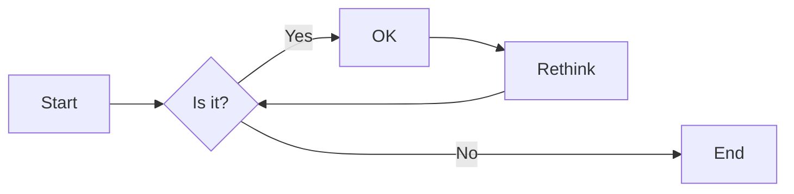

# 实验三 数据可视化(4学时)

## 实验目的

1. 利用Matplotlib库进行数据可视化
2. 利用Plotly库进行数据可视化
3. 使用Git进行版本控制和团队协作
4. 能简单地使用Numpy和Pandas处理数据

## 实验环境

1. Git
2. Python
3. VSCode
4. VSCode插件
   - Python
   - Markdown PDF
   - Markdown Preview Mermaid Support
   - GitLens

## 实验内容和步骤

### 第一部分 实验环境的安装

1. 在命令行运行`pip install`命令，安装如下软件库:
   - matplotlib
   - plotly
   - numpy
   - pandas
  
2. 安装vscode以及vscode的插件:
   - Python
   - Markdown PDF
   - Markdown Preview Mermaid Support
   - GitLens

### 第二部分 教材第15章-生成数据

按照教材章节完成数据可视化第一部分开发：

- 15.2 绘制简单的折线图
- 15.3 随机游走
- 15.5 使用Plotly模拟掷骰子

重点需要完成的习题任务：

- 练习 15.3：分子运动　修改 rw_visual.py，将其中的 ax.scatter() 替换为 ax.plot()。为了模拟花粉在水滴表面的运动路径，向 plt.plot()传递 rw.x_values 和 rw.y_values，并指定实参 linewidth。请使用 5000 个点而不是 50 000 个点，以免绘图中的点过于密集。

- 练习 15.7：同时掷三个骰子　在同时掷三个 D6 时，可能得到的最小点数为3，最大点数为 18。请通过可视化展示同时掷三个 D6 的结果。

### 第三部分 教材第16章-下载数据

按照教材章节完成数据可视化第二部分开发：

- 16.1 CSV文件格式
- 16.2 制作全球地震散点图

重点需要完成的习题任务：

- 练 习 16.9： 全 球 火 灾　在 本 章 的 源 代 码 文 件 中， 有 一 个 名 为world_fires_1_day.csv 的文件，其中包含全球各地的火灾信息，这些信息包括经度、纬度和火灾强度（brightness）。使用 16.1 节介绍的数据处理技术以及本节介绍的散点图绘制技术，绘制一幅散点图展示哪些地方发生了火
灾。

### 第四部分 教材第17章-使用API

按照教材章节完成数据可视化第三部分开发：

- 17.1 使用API
- 17.2 使用Plotly可视化仓库

重点需要完成的习题任务：

- 练习 17.1：其他语言　修改 python_repos.py 中的 API 调用，使其在生成的图形中显示其他语言最受欢迎的项目。请尝试语言 JavaScript、Ruby、C、Java、Perl、Haskell 和 Go。
  
- 练习 17.4：进一步探索　查看 Plotly 以及 GitHub API 或 Hacker News API的文档，根据从中获得的信息来定制本节绘制的图形的样式，或提取并可视化其他数据。

### 第五部分 编写实验报告

使用Markdown编辑器（例如VScode）编写本次实验的实验报告，使用[实验三报告模板](/Experiments/experiment3_report.md)，并将其导出为 **PDF格式** 来提交。

## 实验过程与结果的要求

实验项目分组进行，小组内部需要对项目的工作分工，每个小组成员提交的报告内容应该主要是自己分配完成的工作。（也可以在报告中引用其他组员完成的工作，但应该以自己完成的工作为主。）

注意代码需要使用markdown的代码块格式化，例如：


显示效果如下：

```python
def add_binary(a,b):
    return bin(a+b)[2:]
```

使用Mermaid绘制程序流程图和类图（注意：画图应该尽可能简单易懂，表达最主要的观点，不宜过度的详细和过多的使用），安装Mermaid的VSCode插件：

- Markdown Preview Mermaid Support
- Mermaid Markdown Syntax Highlighting

使用Markdown语法绘制你的程序绘制程序流程图，描述数据可视化程序的主要流程，Markdown代码示例如下：


显示效果如下：



查看Mermaid流程图语法-->[点击这里](https://mermaid.js.org/syntax/flowchart.html)

**注意：不要使用截图，Markdown文档转换为Pdf格式后，截图可能会无法显示。**
