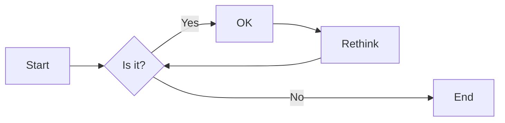

# 实验三 数据可视化(4学时)

## 实验目的

1. 利用Matplotlib库进行数据可视化
2. 利用Plotly库进行数据可视化
3. 使用Git进行版本控制和团队协作
4. 能简单地使用Numpy和Pandas处理数据

## 实验环境

1. Git
2. Python
3. VSCode
4. VSCode插件
   - Python
   - Markdown PDF
   - Markdown Preview Mermaid Support
   - GitLens

## 实验内容和步骤

### 第一部分 实验环境的安装

1. 在命令行运行`pip install`命令，安装如下软件库:
   - matplotlib
   - plotly
   - numpy
   - pandas

2. 安装vscode以及vscode的插件:
   - Python
   - Markdown PDF
   - Markdown Preview Mermaid Support
   - GitLens


### 第二部分 使用Git进行团队协作

1. 由项目组长创建一个新的Git仓库，命名为`alien_invasion`，编写项目的`readme.md`文件，例如：

```markdown
# 外星人入侵游戏
[关于项目的一些介绍]
```

2.项目组长将项目的Git仓库链接分享给其他组员，其他组员fork该项目并clone到本地，例如：`git clone https://gitee.com/<teammate_username>/alien_invasion.git`。

3.项目组长创建若干个`dev`分支(每个小组成员都应该有一个分支，例如`dev1`,`dev2`)，其他组员切换到各自的`dev`分支，例如：`git checkout -b dev origin/dev1`。

4.其他组员在各自的`dev`分支上进行开发，开发后提出`pull request`，项目组长或者项目小组成员对提交的代码要进行`code review`:

   - Github Pull Request视频教程：[B站链接](https://www.bilibili.com/video/BV16BtLegEeE)
   - Github的文档：[如何创建pull request](https://docs.github.com/zh/pull-requests/collaborating-with-pull-requests/proposing-changes-to-your-work-with-pull-requests/creating-a-pull-request)

5.将`dev`分支合并到`main`分支, 在合并分支经常会遇到冲突（merge conflicts，冲突在当两个分支对同一个文件的同一个地方的修改不同时发生），处理冲突的工作流程是:

    - 项目团队成员需要进行沟通，了解冲突的来源

    - 讨论可行的解决冲突的方案，例如：
      - 保留当前分支的修改
      - 保留要合并的分支的修改
      - 最理想的方案是重写两个分支的代码并提交，在没有冲突的情况下再合并
      - 合并后再推送（push）到远程仓库

处理冲突的视频教程：[B站链接](https://www.bilibili.com/video/BV1GP2MYKErN)

### 第三部分 教材第15章-生成数据

按照教材章节完成数据可视化第一部分开发：

- 15.2 绘制简单的折线图
- 15.3 随机游走
- 15.5 使用Plotly模拟掷骰子

重点需要完成的习题任务：

- 练习 15.3：分子运动　修改 rw_visual.py，将其中的 ax.scatter() 替换为 ax.plot()。为了模拟花粉在水滴表面的运动路径，向 plt.plot()传递 rw.x_values 和 rw.y_values，并指定实参linewidth。请使用 5000 个点而不是 50 000 个点，以免绘图中的点过于密集。

- 练习 15.7：同时掷三个骰子 在同时掷三个D6时，可能得到的最小点数为3，最大点数为18。请通过可视化展示同时掷三个D6的结果。

### 第四部分 教材第16章-下载数据

按照教材章节完成数据可视化第二部分开发：

- 16.1 CSV文件格式
- 16.2 制作全球地震散点图

重点需要完成的习题任务：

- 练 习 16.9： 全球火灾　在本章的源代码文件中， 有一个名为[world_fires_1_day.csv](world_fires_1_day.csv) 的文件，其中包含全球各地的火灾信息，这些信息包括经度、纬度和火灾强度（brightness）。使用16.1节介绍的数据处理技术以及本节介绍的散点图绘制技术，绘制一幅散点图展示哪些地方发生了火灾。

### 第五部分 教材第17章-使用API

按照教材章节完成数据可视化第三部分开发：

- 17.1 使用API
- 17.2 使用Plotly可视化仓库

重点需要完成的习题任务：

- 练习 17.1：其他语言　修改 python_repos.py 中的 API 调用，使其在生成的图形中显示其他语言最受欢迎的项目。请尝试语言 JavaScript、Ruby、C、Java、Perl、Haskell 和 Go。
- 练习 17.4：进一步探索　查看 Plotly 以及 GitHub API 或 Hacker News API的文档，根据从中获得的信息来定制本节绘制的图形的样式，或提取并可视化其他数据。
- 附加练习： 在上面的实验中，使用`numpy`和`pandas`来处理数据，并进行数据可视化。

### 第六部分 编写实验

使用Markdown编辑器（例如VScode）编写本次实验的实验报告，使用[实验三报告模板](/Labs/experiment3_report.md)，并将其导出为 **PDF格式** 来提交。

## 实验过程与结果的要求

实验项目分组进行，小组内部需要对项目的工作分工，每个小组成员提交的报告内容应该主要是自己分配完成的工作。（也可以在报告中引用其他组员完成的工作，但应该以自己完成的工作为主。）

注意代码需要使用markdown的代码块格式化，例如：


显示效果如下：

```python
def add_binary(a,b):
    return bin(a+b)[2:]
```

使用Mermaid绘制程序流程图和类图（注意：画图应该尽可能简单易懂，表达最主要的观点，不宜过度的详细和过多的使用），安装Mermaid的VSCode插件：

- Markdown Preview Mermaid Support
- Mermaid Markdown Syntax Highlighting

使用Markdown语法绘制你的程序绘制程序流程图，描述数据可视化程序的主要流程，Markdown代码示例如下：


显示效果如下：



查看Mermaid流程图语法-->[点击这里](https://mermaid.js.org/syntax/flowchart.html)

**注意：不要使用截图，Markdown文档转换为Pdf格式后，截图可能会无法显示。**
