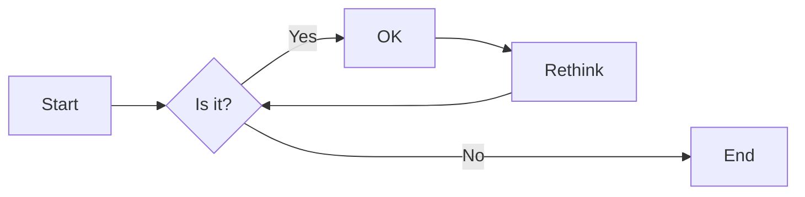
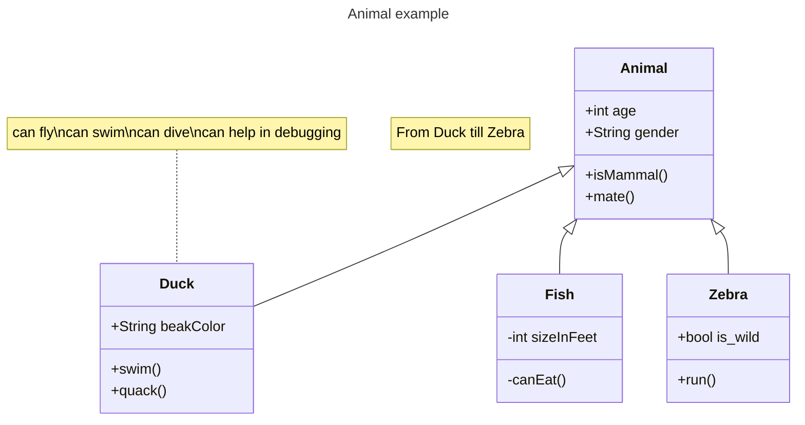

# 实验四 Web应用程序(2学时)

## 实验目的

1. Python虚拟环境的安装和使用
2. 利用Django进行Web应用程序开发
3. 掌握Django的基本开发流程

## 实验环境

1. Git
2. Python
3. VSCode
4. VSCode插件
   - Django
   - SQLite
   - SQLite Viewer

## 实验内容和步骤

### 第一部分 实验环境的安装

1. 创建项目文件夹，在项目文件夹中创建虚拟环境，运行`python -m venv ll_venv`命令。
2. 激活虚拟环境，运行`ll_venv\Scripts\activate`命令。
3. 激活虚拟环境后，在项目文件夹运行`pip install -r requirements.txt`命令，requirements.txt包含了如下软件库:
   - asgiref==3.5.2
   - beautifulsoup4==4.11.1
   - Django==4.1b1
   - django-bootstrap5==21.3
   - platformshconfig==2.4.0
   - soupsieve==2.3.2.post1
   - sqlparse==0.4.2


### 第二部分 使用Git进行团队协作

1. 由项目组长创建一个新的Git仓库，命名为`alien_invasion`，编写项目的`readme.md`文件，例如：

```markdown
# 外星人入侵游戏
[关于项目的一些介绍]
```

2.项目组长将项目的Git仓库链接分享给其他组员，其他组员fork该项目并clone到本地，例如：`git clone https://gitee.com/<teammate_username>/alien_invasion.git`。

3.项目组长创建若干个`dev`分支(每个小组成员都应该有一个分支，例如`dev1`,`dev2`)，其他组员切换到各自的`dev`分支，例如：`git checkout -b dev origin/dev1`。

4.其他组员在各自的`dev`分支上进行开发，开发后提出`pull request`，项目组长或者项目小组成员对提交的代码要进行`code review`:

   - Github Pull Request视频教程：[B站链接](https://www.bilibili.com/video/BV16BtLegEeE)
   - Github的文档：[如何创建pull request](https://docs.github.com/zh/pull-requests/collaborating-with-pull-requests/proposing-changes-to-your-work-with-pull-requests/creating-a-pull-request)

5.将`dev`分支合并到`main`分支, 在合并分支经常会遇到冲突（merge conflicts，冲突在当两个分支对同一个文件的同一个地方的修改不同时发生），处理冲突的工作流程是:

    - 项目团队成员需要进行沟通，了解冲突的来源

    - 讨论可行的解决冲突的方案，例如：
      - 保留当前分支的修改
      - 保留要合并的分支的修改
      - 最理想的方案是重写两个分支的代码并提交，在没有冲突的情况下再合并
      - 合并后再推送（push）到远程仓库

处理冲突的视频教程：[B站链接](https://www.bilibili.com/video/BV1GP2MYKErN)

### 第三部分 教材第18章-Django入门

按照教材章节完成Web应用程序第一部分开发：

- 18.1 建立项目
- 18.2 建立应用程序
- 18.3 创建网页：学习笔记主页
- 18.4 创建其他页面

重点需要完成的习题任务：

- 练习 18.2：简短的条目　当前，当 Django 在管理网站或 shell 中显示Entry 实例时，模型 Entry__str__() 方法都在其末尾加上省略号。请在 __str__() 方法中添加一条 if 语句，仅在条目长度超过 50 个字符时才添加省略号。使用管理网站添加一个不超过 50 个字符的条目，并核实在显示它时不带省略号。

### 第四部分 教材第19章-用户账户

按照教材章节完成Web应用程序第二部分开发：

- 19.1 让用户能够输入数据
- 19.2 创建用户账户
- 19.3 让用户拥有自己的数据

重点需要完成的习题任务：

- 练习 19.4：保护页面 new_entry　一个用户可以在另一个用户的学习笔记中添加条目，方法是在 URL 中指定属于另一个用户的主题的 ID。为了防范这种攻击，请在保存新条目前，核实它所属的主题归属于当前用户。

### 第五部分 教材第20章-设置应用程序的样式并部署

按照教材章节完成Web应用程序第三部分开发：

- 20.1 设置项目“学习笔记”的样式
- 20.2 部署“学习笔记”到任意云平台（可选）
  - 可以选择任意云平台来部署，例如腾讯云、阿里云、华为云等等。
  - 在部署时请到云平台的网站查看有关如何部署的文档，具体部署使用的脚本命令和步骤会和教材有出入。
  - 如果使用Platform.sh尽心部署，请查看官方文档：[Platform.sh文档](https://docs.platform.sh)

重点需要完成的习题任务：

- 练习 20.4：扩展“学习笔记”　在“学习笔记”中添加一项功能，并将修改推送给在线部署。先尝试做一个简单的修改，如在主页中对项目做更详细的描述，再尝试添加一项高级功能，如让用户能够将主题设置为公开的。为此，需要在模型 Topic 中添加一个名为 public 的属性（其默认值为 False），并在页面 new_topic 中添加一个表单元素，让用户能够将私有主题改为公开的。然后，需要迁移项目，并修改 views.py，让未登录的用户也可以看到所有公开的主题。

### 第六部分 编写实验报告

使用Markdown编辑器（例如VScode）编写本次实验的实验报告，使用[实验四报告模板](/Labs/experiment4_report.md)，并将其导出为 __PDF格式__ 来提交。

## 实验过程与结果的要求

实验项目分组进行，小组内部需要对项目的工作分工，每个小组成员提交的报告内容应该主要是自己分配完成的工作。（也可以在报告中引用其他组员完成的工作，但应该以自己完成的工作为主。）

注意代码需要使用markdown的代码块格式化，例如：


显示效果如下：

```python
def add_binary(a,b):
    return bin(a+b)[2:]
```

使用Mermaid绘制程序流程图和类图（注意：画图应该尽可能简单易懂，表达最主要的观点，不宜过度的详细和过多的使用），安装Mermaid的VSCode插件：

- Markdown Preview Mermaid Support
- Mermaid Markdown Syntax Highlighting

使用Markdown语法绘制你的程序绘制程序流程图，描述数据可视化程序的主要流程，Markdown代码示例如下：


显示效果如下：



查看Mermaid流程图语法-->[点击这里](https://mermaid.js.org/syntax/flowchart.html)

使用Markdown语法绘制你的程序绘制程序类图，描述学习笔记Web应用程序的主要的类的结构，Markdown代码示例如下：


显示效果如下：



查看Mermaid类图的语法-->[点击这里](https://mermaid.js.org/syntax/classDiagram.html)

__注意：不要使用截图，Markdown文档转换为Pdf格式后，截图可能会无法显示。__
